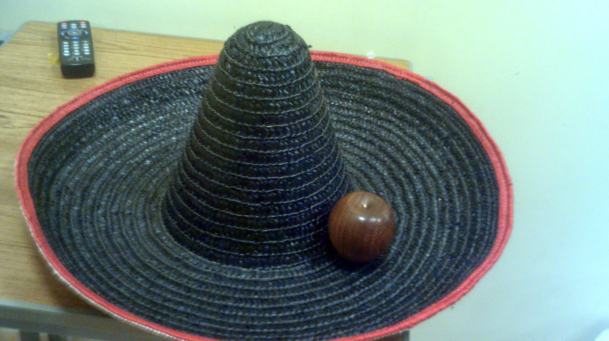
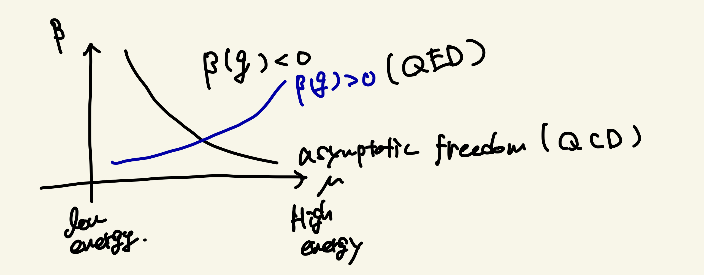

# Seiberg–Witten Theory: Personal Notes

These notes summarize what I learned from a activity on Seiberg–Witten theory. The goal is to understand the concept from a physics perspective.

---

## Motivation

Seiberg–Witten theory gives an exact description of certain four-dimensional supersymmetric gauge theories. The important point is that it can describe strongly coupled physics without relying on perturbation theory.

The rough flow of this note is:

1. Review gauge theory  
2. Gauge Invariants and SSB
3. Beta Function 
4. What is Perturbation Theory? 
5. Seiberg–Witten Theory and Duality    

---

## 1. Review of Gauge Theory

In classical electromagnetism, the physical fields are:

$$
\mathbf{E}, \mathbf{B}
$$

These can be written in terms of scalar and vector potentials:

$$
\mathbf{E} = -\nabla \phi - \frac{\partial \mathbf{A}}{\partial t}
$$

$$
\mathbf{B} = \nabla \times \mathbf{A}
$$

A charged particle experiences the Lorentz force:

$$
m\ddot{\mathbf{x}} = q \left( \mathbf{E} + \dot{\mathbf{x}} \times \mathbf{B} \right)
$$

The key point is that $\phi$ and $\mathbf{A}$ are not unique. This freedom is called **gauge freedom**.

---

In tensor formalism, these relations can be rewritten as:

### Covariant Derivative and Field Strength

$$
D_\mu = \partial_\mu - i e A_\mu
$$

$$
[D_\mu, D_\nu] = -i e F_{\mu\nu}
$$

Gauge transformation:

$$
\phi \rightarrow \phi' = e^{-i e \theta(x)} \phi
$$

---

### Standard Model Gauge Group

$$
SU(3)_C \times SU(2)_L \times U(1)_Y
$$

Here, $C$ denotes color and $L$ denotes left-handed fields.

Spontaneous symmetry breaking (SSB) gives rise to electromagnetism:

$$
SU(2)_L \times U(1)_Y \rightarrow U(1)_{\mathrm{EM}}
$$

---

## 2. Gauge Invariance and SSB

A naive mass term:

$$
m^2 A_\mu A^\mu
$$

is **not gauge invariant**.

This issue is resolved through spontaneous symmetry breaking, which can be visualized using the so-called *Mexican hat potential*.

*Figure: Mexican-hat–like geometry illustrating spontaneous symmetry breaking. The symmetric point is unstable, while the circle of minima represents degenerate vacua. Fluctuations along the valley correspond to Nambu–Goldstone modes.*

---

### Spontaneous Symmetry Breaking

Potential:

$$
V(\phi) = \left(|\phi|^2 - \frac{v^2}{2}\right)^2
$$

Expand around the vacuum:

$$
\phi = \phi_0 + \delta \phi
$$

- Massive mode  
- Massless Nambu–Goldstone mode  

---

## 3. Beta Function 

$$
\beta(g) = \mu \frac{dg}{d\mu}
$$

One-loop result:

$$
\beta(g) = -\frac{g^3}{48\pi^2}(11N - 2N_f)
$$

- $\beta < 0$ → asymptotic freedom (QCD)  
- $\beta > 0$ → QED  

Here, $N$ is the number of colors and $N_f$ is the number of fermion flavors.

*Figure: Asymptotic behavior of the beta function (black solid line)*

Studying strong coupling is difficult because perturbation theory becomes invalid.

---

## 4. What is Perturbation Theory?

Consider the Gaussian integral:

$$
\int dx\, e^{-\frac{a}{2}x^2} = \sqrt{\frac{2\pi}{a}}
$$

This can be solved exactly. Now consider an interacting case:

$$
I(\lambda) = \int dx\, e^{-\frac{a}{2}x^2 - \lambda x^4}
$$

To evaluate this, we expand:

$$
e^{-\lambda x^4}
= \sum_{n=0}^{\infty} \frac{(-\lambda)^n x^{4n}}{n!}
$$

Substituting back:

$$
I(\lambda) = \sum_{n=0}^{\infty} \int dx\, e^{-\frac{a}{2}x^2} \frac{(-\lambda)^n x^{4n}}{n!}
$$

Strictly speaking, exchanging the sum and integral is not always valid, and the series may not converge.

However, if $\lambda$ is small, higher-order terms can be neglected. This is the basic idea of perturbation theory.

---

### Strong Coupling Problem

$$
\text{small coupling} \Rightarrow \text{perturbation works}
$$

$$
\text{large coupling} \Rightarrow \text{fails}
$$

QCD becomes strongly coupled at low energy, making it difficult to analyze.

Seiberg–Witten theory addresses this issue in 4D $\mathcal{N}=2$ supersymmetric Yang–Mills theory.

---

## 5. Seiberg–Witten Theory and Duality

### What is Duality?

Duality means that two different descriptions of a theory are connected and describe the same physics.

Examples:
- Kramers–Wannier duality  
- Electromagnetic duality  

Maxwell symmetry:

$$
(\mathbf{E}, \mathbf{B}) \rightarrow (\mathbf{B}, -\mathbf{E})
$$

---

### Seiberg–Witten Theory

Exact solution for:

$$
\mathcal{N}=2 \quad SU(2) \text{ Yang–Mills}
$$

Key idea:

$$
\text{strong coupling}
\Longleftrightarrow
\text{weak coupling (dual)}
$$

---

## 6. Main Takeaway

- Gauge symmetry restricts the structure of the theory  
- Perturbation theory fails at strong coupling  
- Seiberg–Witten theory provides an exact description of 4D $\mathcal{N}=2$ supersymmetric Yang–Mills theory  

---

## Personal Summary

In this note, we reviewed basic quantum field theory concepts, especially gauge theory, and their connection to Seiberg–Witten theory. We will study the details more carefully in the future.